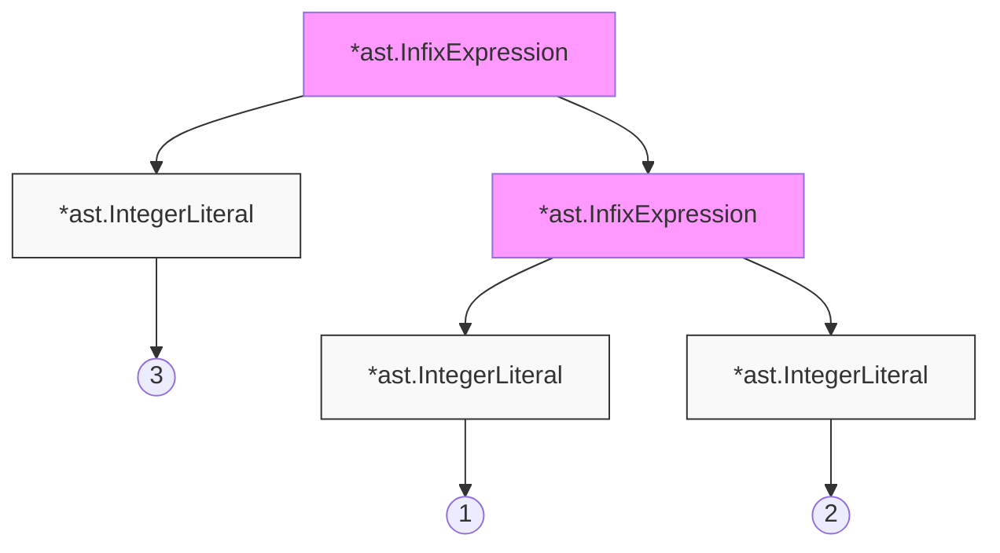
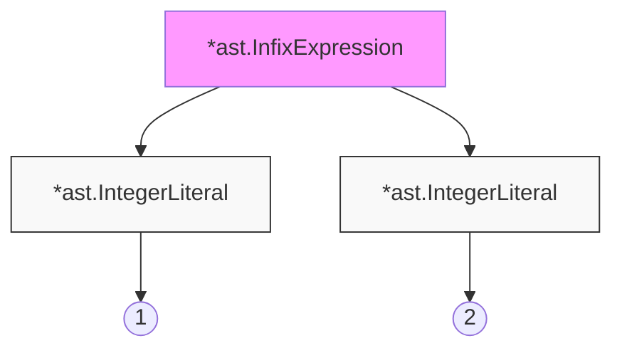

Interpretatory to pozornie proste rzeczy, które przyjmują  tekst i produkują z niego coś co ma faktyczną wartość i funkcjonlaność. 

Książka ta będzie sprowadzała się do napisania prostego interpretatora, który będzie funkcjonował we współpracy z wymyślonym, prostym językiem programowania. Interpreter znajduje się gdzieś między kodem a kompilatorem.

Intepretatory mają wiele różnych smaków
- są takie bardzo proste, które w sumie nic nie sprawdzają - interpretatory brainfucka
- są takie bardziej złożone, które bazuję na idei JIT (just in time), aby na w czasie rzeczywistym przekazywać kod do kompliacji na język binary
- są takie, które budują AST (abstract syntax tree) z kodu źródłowego a następnie analizują tak powstałe drzewo - tree-walking. Taki będziemy tutaj robić
	będzie On posiadał, lexer, parser, reprezentację drzewa oraz ewaluator.

Język, który będziemy interpretować to monkey-language. Jego feature'y to:
- C like syntax
- variable bindings
- integers and booleans
- wyrażenia arytmetyczne
- built-in functions
- first-class and higher-order functions - funkcje first class oznacza, że funkcje mogą być przekazywane do metod jako parametry.
- closures
- stringi
- tablice
- hash-e (tablice klucz wartość)

Interpreter będzie miał takie feature'y:
- lexer
- parser
- AST (abstrakt syntax tree)
- internal object system
- evaluator
Będą One budowane w takiej kolejności. Oznacza to, że nie niestety po pierwszych lekcjach nie będę w stanie napisać prostego programu typu "Hello World".

Czemu w GO? 
- Jest łatwy w czytaniu i zrozumieniu
- posiada super tooling - możemy skupić się na pisaniu naszego interp. a nie zewnętrznych bibliotekach. 
- dobrze się mapuje na takiej języki jak C i C++ w których interp są często napisane.
- kod, który będziemy pisać będzie prosty, oczywisty i bez meta złożonych triko programów.

# Lexer

## Intro

Source code nie jest najlepszą formą danych z którymi przyjdzie nam współpracować, ponieważ może to być łatwe na początku ale wraz ze wzrostem ilości funckjonalności, ten problem szybko przestaje być do ogarnięcia. Dlatego będzie go transformować na inne formy

Source Code -> Tokeny ->  AST

Pierwsza z tych przemian nazywany jest "lexical analysis" albo "lexing". Lexer jest też nazywany tokenizer albo scanner.

Tokeny same w sobie to małe struktury danych, które są potem przekazywane do parsera, który wykonuje drugą z transformacji przetworzenie ich w AST. Tokeny, będą połączone z kodem, który tokenizują przykładowa zamiana
`let x` -> `[LET, IDENTIFIER("x") ]`
Pierwszą rzeczą podczas projektowania takiego lexera jest zdefiniowanie naszych tokenów. Musimy nazwać wszystkie rzeczy takie jak zwykłe liczby: 5,10. Nazwy zmiennych `x` tutaj będą nazywane `IDENTIFIER("x")`. Ale potrzebuje też nazw na bardziej złożone rzeczy takie jaki `fn` czy `let` oraz wszystkie nawiasy 

Tokeny będziemy zbierać do odpowiedniej struktury, którą zdefiniujemy w pliku `token.go`. Zdefiniujemy sobie typ tokenu - `TokenType`. W prawdziwym tokenizerze ta wartość była prędzej intem albo bytem ale dla naszego przykładu, używanie stringów będzie znacznie łatwiejsze do debudowania i rozumienia. Będziemy też mieli pojedynczy token, do którego będziemy się w stanie odwołać po jego nazwie - `Token`. W tym pliku będziemy też zbierać wszystkie nasze słowa kluczowe używane w kodzie naszego języka.

``` go
type TokenType string

type Token struct {
	Type    TokenType
	Literal string
}
```

Do tego potrzebny jest będzie jeszcze agregator wszystkich tokenów.
``` go
const (
	ILLEGAL = "ILLEGAL"
	EOF     = "EOF"

	// Identifiers + literals
	IDENT = "IDENT" // add, foobar, x, y, ...
	INT   = "INT"   // 1343456
...)
```

## Parsowanie prostych znaków

Funkcją lexera jest wzięcie kodu źródłowego i zrobienie z niego serii tokenów. Nie potrzebne są żadne buffery czy pamięci, ponieważ będzie się tylko odwoływać do metody `NextToken()`. Zainicjalizujemy nasz lexer przekazując mu cały kod źródłowy a potem będziemy wołać `NextToken()`, aż nie przejdziemy przez całość kodu.
W kodzie projektowym, do lexera będzie przekazywać jeszcze `io.Reader`, ponieważ zależeć nam będzie na uzyskaniu efektów tego procesu na wypadek błędu. Np. treść błędu, plik w jakim błąd się pojawił oraz linijkę tekstu

Lexer będzie tego typu strukturą:
``` go 
type Lexer struct {
	input string
	//there are 2 pointers, cause sometime we have to peek further in the input string
	position     int
	readPosition int
	ch           byte //current char
}

func New(input string) *Lexer {
	l := &Lexer{input: input}
	return l
}
```
Posiada 2 pointer, żeby podejrzeć kolejny znak. `Read position` zawsze wskazuje jeden znak dalej.

Do czytania znaków użyta jest prosta funckja:
``` go
func (l *Lexer) readChar() {
	if l.readPosition >= len(l.input) {
		l.ch = 0
	} else {
		l.ch = l.input[l.readPosition]
	}
	l.position = l.readPosition
	l.readPosition += 1
}
```

Ten lexer będzie wspierać tylko i wyłącznie znaki ASCII, nie cały unicode. Uprasza to kod o tyle, że nie musimy przyjmować większych niż bajtowe zmiennych (używam byte a nie rune) oraz nie musimy zakładać sprawdzania znaków dalej niż z 1 pozycję.

Next token będzie wyglądać w ten sposób:
``` go 
func (l *Lexer) NextToken() token.Token {
	var tok token.Token
	switch l.ch {
	case '=':
		tok = newToken(token.ASSIGN, l.ch)
...
	case 0:
		tok.Literal = ""
		tok.Type = token.EOF
	}

	l.readChar()
	return tok
}
```
gdzie new Token tworzy po prostu nowy obiekt tokena na podstawie typu i wartości tekstowej 
```go
func newToken(tokenType token.TokenType, ch byte) token.Token {
	return token.Token{Type: tokenType, Literal: string(ch)}
}
```
następnie jak sprawdzimy wartość to czytamy kolejny znak poprzez `l.readChar()`

Teraz będzie rozbudowywać procesowane znaki. Najpierw trzeba dodać sposób na rozpozawanie zmiennych oraz pełnych słów kluczowych taki jak let czy var
``` go
default:
	if isLetter(l.ch) {
		tok.Literal = l.readIdentifier() //this moves several positions until it meets a character that does not much any known keyword.
		tok.Type = token.LookupIdent(tok.Literal)
		return tok
	} else {
		tok = newToken(token.ILLEGAL, l.ch)
	}
}
```
dodany też został `token.ILLEGAL`, który będzie sugerował potencjalny błąd w składni.
Samo przypisanie rodzaju zmiennej lub keywordu odbywa się w metodzie LookupIdent, która sprawdza, czy przekazany string zawiera się w dozwolonych keywordach, jeśli nie zakładamy, że jest to zmienna.
```go
var keywords = map[string]TokenType{
	"fn":  FUNCTION,
	"let": LET,
}

func LookupIdent(ident string) TokenType {
	if tok, ok := keywords[ident]; ok {
		return tok
	}
	return IDENT
}
```
Trzeba też dodać na początku `nextToken` metodę, która będzie pomijać spacje i znaki końca linii:
``` go 
func (l *Lexer) skipWhitespace() {
	for l.ch == ' ' || l.ch == '\t' || l.ch == '\n' || l.ch == '\r' {
		l.readChar()
	}
}
```
Kiedy już jesteśmy w stanie parsować słowa, trzeba zacząć parsować też liczby. Dodajemy nowy case w defaultcie, który będzie interpretować liczby. 

## Parsowanie złożonych znaków

Teraz dodamy wsparcie dla nowych znaków. Dzielą się OIne na 3 grupy
- jednoznakowe - `-`,`+`
- dwuznakowe - `==`
- wieloznakowe - `return`
Wszystkie dodawane znaki, będą od razu pokryte testem w pliku `lexer_test.go`. Warto tutaj zwrócić uwagę na to, że mogę dodać linię tekstu typu 
```
!-/*5;
5 < 10 > 5;
```
które nie mają zbytnio sensu z perspektywy kodu ale lexer nie ma nam powiedzieć czy kod ma sens. Ma On tylko przekonwertować tekst na serię tokenów. Sprawdzamy czy znaki będą poprawnie zamienione na tokeny, nie czy kod ma sens. 
Nowe znaki oraz dodatkowe keywords po prostu dodaję w taki sam sposób jak to robiłem poprzednio. Problem pojawia się w przypadku dwuznakowych operatorów. Tutaj trzeba dodać nowy sposób handlowania tego do całego case'a.
```go
case '=':
	if l.peekChar() == '=' {
		ch := l.ch
		l.readChar()
		literal := string(ch) + string(l.ch)
		tok = token.Token{Type: token.EQ, Literal: literal}
	} else {
		tok = newToken(token.ASSIGN, l.ch)
	}
case '!':
	if l.peekChar() == '=' {
		ch := l.ch
		l.readChar()
		literal := string(ch) + string(l.ch)
		tok = token.Token{Type: token.NOT_EQ, Literal: literal}
	} else {
		tok = newToken(token.BANG, l.ch)
	}
```
Tutaj robimy operację, która podgląda kolejny znak i jeśli jest zgodny z naszym przewidywanym kolejnym znakiem (za pomocą metody `peekChar` - która sprawdza kolejny znak ale nie przesuwa pointera) to zwracamy nasz combo dwuznak.

## REPL
Monkey language dla którego piszemy intepreter musi mieć coś co nazywa się REPL - "Read Eval Print Loop". REPL istnieje już w wielu językach takich jak python, Ruby, Js etc. REPL czasami nazywany jest **Konsolą** albo **Interactive mode**. 
Koncept jest zawsze taki sam. REPL zczytuje dane wejściowe wysyła do interpretatora, który przeprowadza ewaluację i zwraca rezultat lub output a następnie zaczyna znowu. 
**Read, Eval, Print, Loop.**

Repl wygląda dość prosto. Będzie brać podany tekst i parsować go na token:
``` go
func Start(in io.Reader, out io.Writer) {
	scanner := bufio.NewScanner(in)

	for {
		fmt.Fprintf(out, PROMPT)
		scanned := scanner.Scan()
		if !scanned {
			return
		}

		line := scanner.Text()
		l := lexer.New(line)
		for tok := l.NextToken(); tok.Type != token.EOF; tok = l.NextToken() {
			fmt.Fprintf(out, "%+v\n", tok)
		}
	}
}
```
Uruchamiamy go startując naszego maina i przekazując do REPLa std in i out
``` go
func main() {
	user, err := user.Current()
	if err != nil {
		panic(err)
	}
	fmt.Printf("Hello %s! This is Jedreks programming langugae!\n", user.Username)
	fmt.Printf("Rob ta co chce ta\n")
	repl.Start(os.Stdin, os.Stdout)
}
```
No i w efekcie ładnie wszystko tokenizuje.

# Parsing.

Parser będzie brał przetokenizowane znaki i konstruował z tego drzewo, które będzie następnie odpowiedzialne za robienie rzeczy jak na kod przystało.

Zgodnie z [Wiki](https://en.wikipedia.org/wiki/Parsing#Parser) parser to:

> A parser is a software component that takes input data (typically text) and builds a data structure – often some kind of parse tree, abstract syntax tree or other hierarchical structure, giving a structural representation of the input while checking for correct syntax `[...]` The parser is often preceded by a separate [lexical analyser](https://en.wikipedia.org/wiki/Lexical_analysis "Lexical analysis"), which creates tokens from the sequence of input characters; alternatively, these can be combined in [scannerless parsing](https://en.wikipedia.org/wiki/Scannerless_parsing "Scannerless parsing").

Co według autora jest całkiem dobry opisem tego co będzie robić.

Przykładowo jeśli weźmiemy JSON string to parser przerobi nam tekst na strukturę danych do której pól możemy się z łatwością odwoływać.
Różnica między parserem JSONa a tym dla kodu to to, jak rodzaj danych ten parser wyprodukuje. To czym jest JSON i YAML łatwo zrozumieć. Parser kodu wyprodukuje Abstrakt Syntax Tree. Jego abstrakcyjność polega na tym, że nie wszystkie detale z kodu będą miały odzwierciedlenie w AST. 

Oczywiście kształt i forma AST jest zależna od języka i nie ma żadnego uniwersalnego kształtu.

Nasze parser będzie przerabiać serie tokenów na AST.

Będziemy używać parsera a nie parse generatora, które są dostępne i bardzo dobrze napisane. Napisanie parsera od 0 jest dobrym ćwiczeniem na rzecz lepszego zrozumienia funkcjonowania parsera.

## Pisanie parsera

Podczas pisania parsera możemy przyjąć 2 strategie:
- top down
- bottom up
Parser, który będziemy pisać to **"Recursive Decent Parser"** lub Pratt Parser
Ten parser nie będzie najszybszy i będą mogły pojawić się błędy syntaxu, które nie będą wyłapywane. Jest to trade-off, który musimy zaakceptować. 
Proces pisania tego kodu będzie stopniowy i po kolei będą brane kolejne statementy, tak żeby nie było to overwellming. Zaczniemy od `let` i `return`.

`Let` może przyjmować wiele różnych form, ponieważ można do niego przypisać zarówno zmienną, obliczenie, logical statemetn czy całą funkcję.
Najpierw patrzymy na `let x = 5;`

Co to znaczy, że `let` jest poprawnie sparsowany? To, żę AST w poprawny sposób reprezentuje informację zawartą w oryginalnym statemencie.

Z reguły `let` sprowadza się do czegoś takiego
`let <indetifier> = <expression>`
i to tyczy się każdego wywołania, jedynie różnić się będzie złożoność tego co chowa się pod `expression`

Ważne też zwrócić uwagę na różnice między `expression` i `statement`
- `expression` - produkuje wartość, przykładowo `add(5,5)`, `5`
- `statement` -  nie produkuje wartości `return 5`, `let x = 5`
Ten podział jest ważny z tego względu, że AST będzie podzielone na 2 różne rodzaje node'ów - expression node i statement node.

Ten podział będzie widoczny w kodzie, ponieważ per node tworzymy interfejs:
``` go
type Node interface {
	//używane do debugowanie
	TokenLiteral() string
}

type Statement interface {
	Node
	statementNode()
}

type Expression interface {
	Node
	expressionNode()
}
```

Root drzewa będzie zawarty w `Program`
``` go
type Program struct {
	Statements []Statement
}

func (p *Program) TokenLiteral() string {
	if len(p.Statements) > 0 {
		return p.Statements[0].TokenLiteral()
	} else {
		return ""
	}
}
```

Do tworzenia AST będziemy wykorzystywać struktury statementu, które będą wyglądać w taki sposób:
``` go
type LetStatement struct {
	Token token.Token
	Name  *Identifier
	Value Expression
}

func (ls *LetStatement) statementNode()       {}
func (ls *LetStatement) TokenLiteral() string { return ls.Token.Literal }
```
Per każdy znak (? albo znak, albo typ, nie wiem jak to nazwać) będziemy tworzyć taki obiekt. W tym Let posiadam `Identifier`, który pozwala zachować połączenie między x i wartością  `let x = 5;`.
![[Pasted image 20250330115956.png]]
Drzewo programu `let x = 5;` będzie prezentować się w powyższy sposób.

Teraz jak mamy obiekty drzewa to można zacząć pisać dla nich parser.
``` go
type Parser struct {
	l *lexer.Lexer

	curToken  token.Token
	peekToken token.Token
}
```
W parserze potrzebujemy mieć możliwość patrzenia na obecny i kolejny token. Stąd 2 obiekty tokenów. Do tego lexer, który ztokenizował interpretowany kod.
Znaki czytamy, tak, że czytamy kolejny znak, a poprzeni kolejny znak przypisujemy do obecnego.
``` go 
func (p *Parser) nextToken() {
	p.curToken = p.peekToken
	p.peekToken = p.l.NextToken()
}
```
Parser będzie działał rekurencyjnie. Na podstawie znaku, na który natrafi w danej chwili będzie rekurencyjnie podróżować aż zakończy oczekiwane wyrażenie bądź natrafi na błąd. Przykładowo jak natrafi na 
`let x = add(2,3)` to będzie podróżować aż nie skończy gałęzi drzewa, które będzie zawierać identifier oraz funkcji wraz z jej argumentami. 
Drzewo będzie miało swój root na początku programu. 

Jak zwykle został dodany test, który sprowadza poprawność sparsowanych wartości, który powoli będzie zazieleniać poprzez dodawania parsowania kolejnych rzeczy.
### Let
Na początek będzie szedł Let.

Parsowanie zaczyna wyglądać w takim sposób:
``` go 
func (p *Parser) ParseProgram() *ast.Program {
	program := &ast.Program{}
	program.Statements = []ast.Statement{}

	for p.curToken.Type != token.EOF {
		stmt := p.parseStatement()
		if stmt != nil {
			program.Statements = append(program.Statements, stmt)
		}
		p.nextToken()
	}
	return program
}
```
Tak długo jak nie dotrzemy do końca pliku będzie parsować statementy. Jeśli udało się sparsować statement dodajemy go. Kiedy sparsujemy całość to zwracamy strukturę programu.
Parsowanie będzie wyglądać tak:
``` go
func (p *Parser) parseStatement() ast.Statement {
	switch p.curToken.Type {
	case token.LET:
		return p.parseLetStatement()
	default:
		return nil
	}
}
```
i będziemy go populować per każdy statement.
Parsowanie wygląda na dość złożone ale esencja sprowadza się do tego, że po spotkaniu tokenu LET poruszamy się w dal assertując poprawność kolejnych znaków. Przykładowo po `LET` oczekujemy `IDENT`, bo musimy mieć identifier. Potem oczekujemy `=` a potem analizujemy expression aż nie dotrzemy do `;`.

Dodany też został mechanizm łapania errorów. Podczas parsowania będziemy dodawać do tablicy errorów parsera błędy, które pojawiły się przy parsowaniu:
``` go
func (p *Parser) expectPeek(t token.TokenType) bool {
	if p.peekTokenIs(t) {
		p.nextToken()
		return true
	} else {
	//pojawił się znak, który jest niezgodny z oczekiwaną sekwencją
		p.peekError(t)
		return false
	}
}

func (p *Parser) peekError(t token.TokenType) {
	msg := fmt.Sprintf("expected next token to be %s, got %s instead",
		t, p.peekToken.Type)
	p.errors = append(p.errors, msg)
}
```
Teraz taki statement: `let x 10` da taki error:
`parser_test.go:49: parser error: "expected next token to be =, got INT instead"`
### Return 
Return ma inną formułę niż LET - `return <expression>`
Parsowanie jest trywialne, póki nie jest parsowane expression bo dodaje nowy return statement i oczekuje `;`.

### Expression
Pierwszym problemem parsera jest to, że musi On wiedzieć o kolejność operacji matematycznych
to: `5*5+10` musi być rozumiane jako `((5*5)+10)`, żeby łatwo rozróżnić to od `5*(5+10)`
Innym problemem są znaki ujemne `-5-10` ten sam `-` oznacza tutaj 2 różne rzeczy.
Potem jest jeszcze `5*(add(2,3)+10)`, gdzie `(...)` oznaczają coś zupełnie innego.

W języku do którego piszemy parser wszystko po za `let` i `return` to expression. Są
- prefixy - `-5` `!true` `!false`
- infixy - `5+5` `6/5`
- operatory arytemtyczne `foo == bar` `foo > bar`
- złożone wyrażenia z nawiasami - `5*(5+5)` 
- call expression - `max(5, add(5,(5*5)))`
- identyfikatory jako expression - `foo*bar/foobar`
- function literal - `let add = fn(x,y) {return x+y}`
- if literal - `let result = if(10>5) { true } else { false }`

[Publikacja](https://tdop.github.io/) na której będziemy się wzorować. Idee tutaj zawarte zostały między innymi użyte w `JSLincie`

Procesowanie expression trzeba zacząć od dodania nowego typu statementu - expression statement
``` go
type ExpressionStatement struct {
	Token      token.Token
	Expression Expression
}
```
i do każdego statementu dodałem metodę String, która zwraca jego wartość ale nie wiem po co. Chyba na tę chwilę tak żebym był w stanie zwrócić je do jsona? 

### Pratt Parser
Teraz będzie pisany prawdziwy Pratt Parser.

Bazowa jego idea sprowadza się do łączenia metod parsujących (semantic code) z typami tokenów. Każdy token może mieć do 2 funkcji parsujących połączonych ze sobą - zależy to czy token został znaleziony na pozycji prefix czy infix

Dodamy 2 metody parsowanie: prefix i infix 
``` go
type (
	prefixParseFn  func() ast.Expression
	//ten argument jest tym co jest na lewo od infixa, który prasujemy
	infixParseFn func(ast.Expression) ast.Expression 
)
```
Taką mape funkcji parsujących i połączonych kluczy dodajemy do naszego Parsera
``` go
type Parser struct {
	l *lexer.Lexer

	curToken  token.Token
	peekToken token.Token

	errors []string

	prefixParseFn map[token.TokenType]prefixParseFn
	infixParseFn  map[token.TokenType]infixParseFn
}
```
oraz metody, które pozwolą nam zarejestrować te parsery
``` go
func (p *Parser) registerPrefix(tokenType token.TokenType, fn prefixParseFn) {
	p.prefixParseFns[tokenType] = fn
}

func (p *Parser) registerInfix(tokenType token.TokenType, fn infixParseFn) {
	p.infixParseFns[tokenType] = fn
}
```

Metoda parsująca expression statement zostaje dodana jak default case do parseStatement i wygląda Ona tak:
``` go
func (p *Parser) parseExpressionStatement() *ast.ExpressionStatement {
	stmt := &ast.ExpressionStatement{Token: p.curToken}
	stmt.Expression = p.parseExpression(LOWEST)

	if p.peekTokenIs(token.SEMICOLON) {
		p.nextToken()
	}

	return stmt
}
```
idziemy dalej w tokenie dopiero kiedy natrafimy na `;`
LOWEST bierze się z iota
``` go
const (
	_ int = iota
	LOWEST
	EQUALS      // ==
	LESSGREATER // > or <
	SUM         // +
	PRODUCT     // *
	PREFIX      // -X or !X
	CALL        // myFunction(X)
)
```
która definiuje jaka kolejność operacji jest brana pod uwagę przy interpretowaniu precedensów.
Parsowanie expression będzie wyglądać tak
``` go 
func (p *Parser) parseExpression(precedence int) ast.Expression {
	prefix := p.prefixParseFns[p.curToken.Type]
	if prefix == nil {
		return nil
	}
	leftExp := prefix()
	return leftExp
}
```
na tę chwilę. Sprawdza Ona czy istnieje metoda do parsowania na pozycji prefixu.
Trzeba też oczywiście dodać do naszego parsera rejestrowanie funkcji
``` go 
//...
	p.prefixParseFns = make(map[token.TokenType]prefixParseFn)
	p.registerPrefix(token.IDENT, p.parseIdentifier)
//...
func (p *Parser) parseIdentifier() ast.Expression {
    return &ast.Identifier{Token: p.curToken, Value: p.curToken.Literal}
}
```
parse identifier jest odpowiedzialne za dodanie takiego identyfikatora jako `foobar` `x` `y` etc.

wszystkie metody z kolekcji `prefixParseFns` i `infixParseFns` będą działać w taki sam sposób:
1. Zacznij na tym tokenie - `curToken` z którym ta metoda jest powiązana powiązana
2. zwróć `curToken` ostatniego tokena który jest Twoim drzewem expression
3. nigdy nie idź z tokenami za daleko
Nie mam pojęcia co to znaczy
start with `curToken` being the type of token you're associated with and return with `curToken` being the last token that's part of your expression type. Never advance the tokens too far.

Żeby procesować kolejną wartość, integer literal `5;`. Najpierw trzeba dodać Node do drzewa AST
```go
type IntegerLiteral struct {
	Token token.Token
	Value int64
}

func (il *IntegerLiteral) expressionNode()      {}
func (il *IntegerLiteral) TokenLiteral() string { return il.Token.Literal }
func (il *IntegerLiteral) String() string       { return il.Token.Literal }
```
Tutaj pod wartością - `Value` nie będzie string a `int64`
A następnie taki parse integral będzie procesowany do drzewa z tokenu w taki sposób
``` go
func (p *Parser) parseIntegerLiteral() ast.Expression {
	lit := &ast.IntegerLiteral{Token: p.curToken}

	value, err := strconv.ParseInt(p.curToken.Literal, 0, 64)
	if err != nil {
		msg := fmt.Sprintf("could not prase %q as integer", p.curToken.Literal)

		p.errors = append(p.errors, msg)
		return nil
	}

	lit.Value = value

	return lit
}
```

### Prefix operators

Istnieją 2 znaczące prefixy `-` oraz `!`.
`-5` `!foobar` `-5+10`
Struktura takiego prefixu jest zawsze taka `<prefix operator><expression>`. Wszystkie expression mogą być po operatorze prefixa.

Typ prefixu będzie wyglądał następująco:
``` go
type PrefixExpression struct {
	Token    token.Token
	Operator string
	Right    Expression
}
```
Posiada Operator - to co jest faktycznym prefixem oraz expression - Right.
Po uruchomieniu testu w takiej formie w naszym ast będą 2 expression, ponieważ nasz parser nie ma dodanych funkcji parsujących dla wyrażeń powiązanych z prefixami.
Żeby to załatwić dla tokenów `-` oraz `!` trzeba zarejestrować nową metodę parsującą, która stworzy wyrażenie w odpowiedni sposób:
``` go
func (p *Parser) parsePrefixExpression() ast.Expression {
	expression := &ast.PrefixExpression{
		Token:    p.curToken,
		Operator: p.curToken.Literal,
	}
	//wiem, że kolejny token będzie miał sensowną wartość, więc idziemy krok dalej
	p.nextToken()

	expression.Right = p.parseExpression(PREFIX)

	return expression
}
```

### Infix operator
Teraz będziemy parsować operatory infix - `5+5` `6<5` `5==5` ich forma zawsze wygląda tak `<expression> <infix operator> <expression>`

Podobnie jak z prefixem tutaj też musimy stworzyć nowy expression, który będzie składać się z 3 elementów - `Left` `Operator` `Right`
``` go

type InfixExpression struct {
	Token    token.Token // The operator token, e.g. +
	Left     Expression
	Operator string
	Right    Expression
}

...
func (ie *InfixExpression) String() string {
	var out bytes.Buffer

	out.WriteString("(")
	out.WriteString(ie.Left.String())
	out.WriteString(" " + ie.Operator + " ")
	out.WriteString(ie.Right.String())
	out.WriteString(")")

	return out.String()
}
```
Żeby to zadziałało nie wystarczy tylko rozszerzyć parser o nową funkcję, ponieważ parser w obecnej formie, będzie uznawał wyrażenie `5+5` jako najpierw liczbę `5` a potem wyrażenie z prefixem `+5`

Musimy dodać teraz wartości precendeces
``` go
var precedences = map[token.TokenType]int{
	token.EQ:       EQUALS,
	token.NOT_EQ:   EQUALS,
	token.LT:       LESSGREATER,
	token.GT:       LESSGREATER,
	token.PLUS:     SUM,
	token.MINUS:    SUM,
	token.SLASH:    PRODUCT,
	token.ASTERISK: PRODUCT,
	token.LPAREN:   CALL,
}
```
to powiązuje nam wartości tokenów z kolejnością z jaką mają być interpretowane.

Teraz rejestrujemy wszystkie infixy  do naszej kolejki powiązanych znaków i tworzymy metodę, która będzie powiązana z ich wartościami
``` go 
func (p *Parser) parseInfixExpression(left ast.Expression) ast.Expression {
	expression := &ast.InfixExpression{
		Token:    p.curToken,
		Operator: p.curToken.Literal,
		Left:     left,
	}

	precedence := p.curPrecedence()
	p.nextToken()
	expression.Right = p.parseExpression(precedence)

	return expression
}
```
jakimś cudem teraz rozwijamy metodę parse expression o pętlę, która wchodzi w głąb drzewa tak długo aż nie natrafi na `;` albo znak, który ma wyższy precedens
``` go
func (p *Parser) parseExpression(precedence int) ast.Expression {
	prefix := p.prefixParseFns[p.curToken.Type]
	if prefix == nil {
		p.noPrefixParseFnError(p.curToken.Type)
		return nil
	}
	leftExp := prefix()

	for !p.peekTokenIs(token.SEMICOLON) && precedence < p.peekPrecedence() {
		infix := p.infixParseFns[p.peekToken.Type]
		if infix == nil {
			return leftExp
		}

		p.nextToken()
		leftExp = infix(leftExp)
	}

	return leftExp
}
```
 to magicznie działa.

## Jak działa Pratt Parsing

Są małe różnice między implementacją Naszą a oryginalnym prattem ale są One w sumie pomijalne. Liczy się idea.
Spójrzmy na proste wyrażenie:
`1+2+3`
Chcemy aby zserializowane AST wyglądało tak:
`((1+2)+3)`
To znaczy, że nasze drzewo będzie miało 2 node'y `*ast.InfixExpression`
Pierwszy z tych node'ów, wyżej w drzewie, w prawym child elemencie będzie miało integer literal `3` a w child elemencie lewym `*ast.InfixExpression`. Drugi z nich w lewym będzie `1` w prawy `2`.


(ten schemat nie jest do końca poprawny, ponieważ dolny Infix, powinien być lewą odnogą)
### Jak to się dzieje?

`1+2+3`

Kiedy spojrzymy na metodę `parseExpressionStatement`, przy pierwszym wywołaniu wołamy `parseExpression(LOWEST)`, tam `curToken` będzie `1`, `peekToken` będzie `+`.
Następnie sprawdzimy czy ze znakiem czy `p.curToken.Type`-`token.INT` jest powiązana metoda `prefixParseFn`. Jest, więc wołana będzie `parseIntegerLiteral`. Ta metoda z kolei zwróci `*ast.IntegralLiteral`, który zostanie przypisany do `leftExp`

Potem wjeżdża pętla `for` z parseExpression:
``` go
for !p.peekTokenIs(token.SEMICOLON) && precedence < p.peekPrecedence() {
	...
}
```
Jeśli to co poprzedza nie jest `;` to sprawdzamy kolejność `precedence`, który określa kolejność interpretacji. `peekPrecedence` z kolei bierze następny znak w sekwencji i sprawdza jego wartość z naszej tablicy:
``` go
var precedences = map[token.TokenType]int{
	token.EQ:       EQUALS,
	token.NOT_EQ:   EQUALS,
	token.LT:       LESSGREATER,
	token.GT:       LESSGREATER,
	token.PLUS:     SUM,
	token.MINUS:    SUM,
	token.SLASH:    PRODUCT,
	token.ASTERISK: PRODUCT,
	token.LPAREN:   CALL,
}
```
W interpretacji znaków `1` oraz `+` od `peekPrecedence` dostaniemy wartość `SUM` czyli enum o wartości `4`. Jest On większy niż precedence z którym wchodzimy czyli `LOWEST` - `0`.

W naszym przypadku wejdziemy do środka, gdzie dzieje się to:
``` go
infix := p.infixParseFns[p.peekToken.Type]
if infix == nil {
	return leftExp
}

p.nextToken()
leftExp = infix(leftExp)
```
Funkcja `infix` np. dla znaku `+` wywoła ponownie `parseExpression`, więc rekurencyjnie będzie tutaj budowane drzewo. 
Co jest ważne w powyższym fragmencie kodu, to to, że nadpisujemy zmienną `leftExp`. To co zostanie do niej przypisane zależy od tego co jest przypisane jako `infix` do `peekToken`.

Parse `InfixExpression` wygląda tak:
``` go 
func (p *Parser) parseInfixExpression(left ast.Expression) ast.Expression {
	expression := &ast.InfixExpression{
		Token:    p.curToken,
		Operator: p.curToken.Literal,
		Left:     left,
	}

	precedence := p.curPrecedence()
	p.nextToken()
	expression.Right = p.parseExpression(precedence)

	return expression
}
```
Przekazany tutaj jest stary poprzedni `leftExp` czyli `1`. 
Zapisze Ona wartość obecnego `precedence` pójdzie dalej w sekwencji i wywoła `parseExpression` z `prec.` poprzedniego znaku - `+`.
Teraz w parse exp. będzie `curToken` - `2`, `peekToken` - `+`.

Wracając do `parseExp` znowu wywnioskujemy wartość `int. literal` - `2` ale za to, nie wejdziemy do pętli, ponieważ `prec.` będzie miało taką samą wartość jak `peekPrec.`
``` go
func (p *Parser) parseExpression(precedence int) ast.Expression {
	//będzie parse Int Literal
	prefix := p.prefixParseFns[p.curToken.Type]
	if prefix == nil {
		p.noPrefixParseFnError(p.curToken.Type)
		return nil
	}
	leftExp := prefix() //wyliczy `int.literal`

	//false because `SUM` !< `SUM`
	for !p.peekTokenIs(token.SEMICOLON) && precedence < p.peekPrecedence() {
		...
	}
	//od razu zwróci wartość.
	return leftExp
}
```
Wartość `leftExp` jako `2` zostanie zwrócona do `parseInfixExpression` a więc nasze drzewo będzie wyglądać tak: 

Taki operator zostanie zwrócony jako `leftExp` do naszego pierwszego wywołania `parseExp.`. Tam `prec.` ma dalej wartość `LOWEST`. Z taką wartością jednak znowu wejdziemy do środka pętli.

Pamiętając, że `curToken` - `2`, `peekToken` - `+`. Powtórzymy podobną operację jako z obliczeniem pierwotnym z tą różnicą, że `leftExp` nie będzie już `intLiteral` ale naszym stworzonym drzewem z rootem w `infixExp`.
Po kolejnym kroku w `parseInfix` na `peekExp` będzie `;` a więc nasz loop się zakończy.

Kolejność w Precedensie jest kluczowa, ponieważ wartości z wyższym `prec.` mają być głębiej w drzewie (niżej). To jest powiązane z `Right Binding Power` - im wyższa jest tym więcej rzeczy po prawej obecnego wyrażeni, może zostać powiązane z obecnym znakiem. Mogą zostać "wessane". W warunku `prec. < p.peekPrec.()`, sprawdzamy czy `left biding power` kolejnego znaku jest większe niż `RBP` obecnego znaku. Jeśli tak to, to co dotychczas sprasowaliśmy zostaje wciągnięte przez kolejny operator. Będzie więc przekazany do `infixParseFn` kolejnego operatora.

Do parsera mogę dorzucić metody traceujące. Wtedy mogę puścić pojedynczy test:
`go test -v -run TestOperatorPrecedenceParsing ./parser`
I wtedy mogę sobie patrzeć z jakimi wartościami i w jakiej kolejności wywoływany jest kod referencyjny.

Teraz praca sprowadzi się do rozszerzenia parsera wraz z dodaniem helper metod do testów. 

Przykładowo `boolean` dodajemy w taki sposób
``` go

type Boolean struct {
	Token token.Token
	Value bool
}

func (b *Boolean) expressionNode()      {}
func (b *Boolean) TokenLiteral() string { return b.Token.Literal }
func (b *Boolean) String() string       { return b.Token.Literal }
```
Wartość Literala `boolean` to będzie wartość `bool` z Go langu.
### Grouped Expressions
Chodzi o wyrażenia typu
`(5+5)*2`
z racji obecności nawiasów tutaj precedence się zmieni. Wartość `5+5` będzie niżej w drzewie, ponieważ musi się wykonać szybciej. 
Dodałem tyle:
``` go
p.registerPrefix(token.LPAREN, p.parseGroupedExpression)
...
func (p *Parser) parseGroupedExpression() ast.Expression {
	p.nextToken()
	exp := p.parseExpression(LOWEST)

	if !p.expectPeek(token.LPAREN) {
		return nil
	}

	return exp
}
```
i ma działać.

### If expression
Ify wyglądają tak:
`if (<condition>) <consequence> else <alternative>`
Żeby całość logiki przechować należy stworzyć nowy expression
``` go
type IfExpression struct {
	Token       token.Token // The 'if' token
	Condition   Expression
	Consequence *BlockStatement
	Alternative *BlockStatement
}
```
gdzie BlockStatement
``` go
type BlockStatement struct {
	Token      token.Token // the { token
	Statements []Statement
}
```
Block statement jest więc serią Statementów 

### Function literals

`fn(x,y) { return x+y; }`
czyli takie funkcje są interpretowane w taki sposób:
`fn <params> <block statement>`
Block statement jesteśmy w stanie parsować.
Parametry to po prostu lista identyfikatorów podzielonych przecinkiem zawartych w nawiasie. Ta lista może też być pusta.
Patrząc z perspektywy AST function literals to - Expression.
FL możemy używać w każdym miejscu tam gdzie Expression mogą być (są valid). Przykładowo w let statement
`let myFunction = fn(x,y) { return x+y; }`
albo w return statementach
``` ts
fn() {
	return fn(x,y) { return x+y; };
}
```
albo jako parametry innych funkcji
Brzmi to jak wiele różnych case'ów ale jeśli tylko uda się sparsować FL jako expression to wszystkie te case'y będą za darmo.

Z tego powodu FL jest dość prostym obiektem.
``` go
type FunctionLiteral struct {
	Token      token.Token //The `fn` token
	Parameters []*Identifier
	Body       *BlockStatement
}
```
Parsowanie sprowadza się do 2 kroków. Najpierw trzeba sparsować parametry a potem wewnętrzny block statement i będzie git

### Call expression

Call expressions to wywołania funkcji stworzonych w poprzednim kroku functional literals
Te wyrażenia będą wyglądać tak:
`<expression>(<comma separated expressions>)`
przykładowo: `add(1,2)`
Add jest identyfiaktorem więc będzie przyjmować expressions w przykładzie `integer literals`, może to też być oczywiście `3*3*3`.

## Evaluation

Teraz zaczniemy transformować kod, tak żeby zaczął nabierać sens. Kod, który będzie nadawać sens kodu w taki sposób aby `1+2` miało teraz wartość `3`. `5>1` było `true` etc.

Przykładową rzeczą na którą trzeba zwrócić uwagę i podjąć decyzję w jakiej kolejności wyrażenia będą ewaluowane.
``` js
let one = fn() { 
	printLine("one")
	return 1
}

let two = fn() { 
	printLine("two")
	return 2
}

add(one(),two())
```
czy kod powyżej najpierw wypisze "one" czy "two" jest zachowaniem dyktowanym przez konfigurację ewaluatora wewnątrz interpretera.

Jest to mała decyzja, których trzeba będzie kilka podjąć w związku z pisaniem ewaluatora.

Do ewaluatorów można mieć kilka podejść
- najprostsze - przejść po drzewie AST i po prostu wykonywać każdą instrukcję taką jaka jest. Taki algo nazywa się tree-walking interpreter. Takie podejście jest interpreterem z racji bardzo miękkiej granicy między tym co jest interpreterem a co ewaluatorem.
- chodzenie po drzewie ale zamiast od razu interpretować instrukcję najpierw konwertowane są na kod binarny (IR - intermediate representation). Ten kod jest następnie procesowany przez pośrednią maszynę wirtualną - przykładowo to się dzieje w JVM.
- JIT - just in time. Polega na przekonwertowaniu kodu źródłowego na AST. Następnie przeprocesowaniu AST w bytecode. Ostatecznie zamiast wykonywać te instrukcję w maszynie wirtualnej bytecode jest kompilowany do kodu maszynowego zaraz przed wykonaniem instrukcji. 
Im bardziej złożone podejście tym jest Ono szybsze ale też bardziej skomplikowane w implementacji i potencjale popełniania błędów. Przykładowo jeśli używane jest JIT to wtedy język ze swojego designu musi wspierać wiele różnych architektur systemowych. ARM czy x86 i x64.

W Monkey language będziemy używać prosty Tree-walking Inteprer.

### Tree-Walking interpreter

Ten intepreter będzie bardzo podobny do tego w jaki sposób jest napisany w Lisp. Będziemy się wzorować w dużym stopniu na tym jak zostało to zaprezentowane w [SICP](chrome-extension://efaidnbmnnnibpcajpcglclefindmkaj/https://web.mit.edu/6.001/6.037/sicp.pdf).

Będziemy potrzebowali 2 rzeczy:
- tree walking evaluator
- sposób na zaprezentowanie go
Główną funkcją będzie `eval()`
``` go
function eval(astNode){
	if(astNode is integerLit)
		return astNode.integerVal
		
	if(astNode is booleanLit)
		return astNode.booleanVal
		
	if(astNode is  infixExpression)
		leftEval = eval(astNode.left)
		rightEval = eval(astNode.right)
		
		if astNode.Operator == "+"{
			return leftEval + rightEval
		}
		if astNode.Operator == "-"{
			return leftEval - rightEval
		}
		...
}
```
mniej więcej tak to będzie wyglądać. Schodzimy rekursywnie w dół drzewa po kolejnych szczeblach aż nie dotrzemy do wartości albo operacji, które możemy wykonać.

Najbardziej złożoną częścią tego kodu jest rekurencyjne wywołanie eval
``` go
leftEval = eval(astNode.left)
rightEval = eval(astNode.right)
```
jaki rodzaj obiektów zostanie tutaj zwrócony?

**Obiekty w ewaluatorze**

Jest wiele różnych podejść do tego w jaki sposób będą definiowane te obiekty. Przykładowo można użyć typów natywnych dla host language, w tym przypadku GO, albo użyć wskaźników na obszary pamięci i pominąć kompletnie to czym faktycznie jest dana wartość. 
Jeśli np. mówimy o stringu to możemy użyć typu `String` z golanga albo wskazać na przestrzeń w pamięci gdzie znajduje się reprezentacja tego stringa jako abstrakcyjny obiekt. 

Wszystko zależy od podejścia i właściwości host language.

Z racji ilości możliwych podejść nie ma co opisywać każdego. Łatwiej jest po prostu poczytać kilka kodów źródłowych takich impelemetancji. [Przykład ciekawego interpretera](https://github.com/wren-lang/wren) 

Inne pytania dotyczące designu to w jaki sposób użytkownik będzie miał dostęp do zmiennych? Czy będą typy wartościowe czy referencyjne. Przykładowo w Ruby wszystko jest typem referencyjnym. 

W tym interpreterze wszystkie zmienne będą intepretowane jako obiekt `Object`, gdzie `Object` to:
``` go
type ObjectType string

type Object interface{
	Type() ObjectType
	Inspect() string
}
```
Jest to interfejs ponieważ każdy z naszych tokenów będzie go implementować w inny sposób

Kiedy przykładowo napotkamy `Integer` w kodzie najpierw zamieniamy go na `ast.IntegerLiteral` jako Node AST a potem na `object.Integer` zachowując wartość wewnątrz `struct` i dalej będzie przekazywać referencje do tego `struct`. 

Integer będzie więc wyglądać tak:
``` go
type Integer struct {
	Value int64
}

func (i *Integer) Inspect() string  { return fmt.Sprintf("%d", i.Value) }
func (i *Integer) Type() ObjectType { return INTEGER_OBJ }
```
gdzie `INTEGER_OBJ = "INTEGER"`

### Eval()

Teraz będziemy pisać metodę Eval, która odpowiedzialna będzie za wykonanie całości pracy ewaluatora. Każdy z node'ów AST będzie inaczej obsługiwany, a Eval będzie wołany rekurencyjnie. 
Sygnatura Eval:
`func Eval(node ast.Node) object.Object`
Przykładowo jeśli otrzyma `*ast.Program` Eval będzie interpretować po kolei każdy z `*ast.Program.Statements` wywołując sam siebie na każdym ze `statement`ów
``` go
...
	case *ast.Program:
		return evalStatements(node.Statements)
...

func evalStatements(stmts []ast.Statement) object.Object {
	var result object.Object

	for _, statement := range stmts {
		result = Eval(statement)
	}

	return result
}
```
Dla integer:
``` go
case *ast.IntegerLiteral:
	return &object.Integer{Value: node.Value}
```
Ale na przykład dla `Boolean` możemy się ograniczyć do zwracania referencji do statycznego obiektu TRUE albo FALSE
```go
var (
	TRUE  = &object.Boolean{Value: true}
	FALSE = &object.Boolean{Value: false}
)
...
case *ast.Boolean:
	return nativeBoolToBooleanObject(node.Value)
...

func nativeBoolToBooleanObject(input bool) *object.Boolean {
	if input {
		return TRUE
	}
	return FALSE
}
```
Bo nie ma żadnej różnicy między dwoma `true` więc nie ma co tworzyć nowego obiektu dla każdego takiego wywołania.

Tak samo z `Null`. Istnieje tylko jeden pusty `Null`

### Obiekty

#### **Prefix**

Dla prefixów chcemy stworzyć zachowanie, które będzie kombinacją tego jaki jest prefix i jak ma na niego program zaareagować:
```go
...
case *ast.PrefixExpression:
	right := Eval(node.Right)
	return evalPrefixExpression(node.Operator, right)
...	
func evalPrefixExpression(operator string, right object.Object) object.Object {
	switch operator {
	case "!":
		return evalBangOperatorExpression(right)
	default:
		return NULL
	}
}
...

func evalBangOperatorExpression(right object.Object) object.Object {
	switch right {
	case TRUE:
		return FALSE
	case FALSE:
		return TRUE
	case NULL:
		return NULL
	default:
		return FALSE
	}
}
```
Tutaj określamy pewną charakterystykę programu. Wszystko co nie jest Booleanem albo Nullem jest `Truthy` przykładowo `5==true` `!5==false`. Można albo rzucić błędem kiedy pojawi się wywołanie `!5` albo założyć, że `5` jest `Truthy`

Dla prefix `-` musimy najpierw sprawdzić czy `right` to integer, ponieważ tylko dla takiego obiektu prefix `-` ma sens. Jeśli tak to zwracamy nowy obiekt `integer`, gdzie wartość będzie ujemną wartością oryginalnego `right` 
``` go
func evalMinusOperatorExpression(right object.Object) object.Object {
	if right.Type() != object.INTEGER_OBJ {
		return NULL
	}

	value := right.(*object.Integer).Value
	return &object.Integer{Value: -value}
}
```

####  **Infix**

Trzeba napisać obsługę dla 8 rodzajów infix operatorów - matematycznych i logicznych.
Działa to bardzo podobnie do prefixów z tą różnicą, że bierze zarówno lewy i prawy obiekt zanim będzie procesować logikę.

``` go
case *ast.InfixExpression:
	right := Eval(node.Right)
	left := Eval(node.Left)
	return evalInfixExpression(node.Operator, right, left)
```

####  **If Else**

Kiedy analizujemy If Else statement, to bierzemy pod uwagę tylko 1 z segementów, ponieważ warunek ma tylko 1 z rozwiązań w momencie w którym jest analizowane. 
``` go
if(x > 0){
	fizz()
}
else{
	buzz()
}
```
Kiedy ewalulujemy to wyrażenie to x będzie miał jakąś wartość więc bierzemy pod uwagę tylko fizz() albo buzz().

W tym języku `if()` będzie działać na zasadzie `Truthy` czyli `if()` będzie ewaluowany do prawdy jeśli jest tam coś co jest `True` albo nie jest nullem.

Jeśli mamy tylko jedną część ifa a warunek nie jest spełniony to takie wyrażenie powinno zostać ewaluowane jako `null`.
``` go
{"if (false) { 10 }",// input
nil} //expected evaluation
```

Ewaluowanie tych statementów sprowadza się tak naprawdę do tego:
```go 
func evalIfExpression(ie *ast.IfExpression) object.Object {
	condition := Eval(ie.Condition)

	if isTruthy(condition) {
		return Eval(ie.Consequence)
	} else if ie.Alternative != nil {
		return Eval(ie.Alternative)
	} else {
		return NULL
	}
}
```
jeśli `if` jest dobrze sparsowany to musimy po prostu ewaluować jego `ie.Consequence` oraz `ie.Alternative` na podstawie ewaluacji `ie.Condition`.
Decyzja co do zachowania `if` jako pewnego elementu projektowania języka zawarta jest w `evalIfExpression`

#### Return

To w jaki sposób ewaulowany będzie `return` zależy od zdolności i możliwości języka hostującego. Można to obsłużyć takimi komendami jak GOTO albo rzucić wyjątek ale golang nie obsługuje za dobrze tego typu operacji. 

Dlatego w naszym języku będziemy wrapować wartość jaką powinien zwrócić `return` w obiekt z `return value`. Ten obiekt będzie wyglądać tak:
```go
type ReturnValue struct {
	Value Object
}
```
Jest to prosty wrapper na jakiś inny obiekt.
Kiedy taki return się pojawi ewaluujemy go do nowego obiektu, żeby zachować do niego połączenie. 
``` go
evalStatements(...)
...
if returnValue, ok := result.(*object.ReturnValue); ok {
	return returnValue.Value
}
...
```
Problem z tym jest taki, że jeśli mamy zagnieżdżone obiekty to mniej zagnieżdżone ify będą ewaluowane jako pierwsze i w ten sposób, możemy zwrócić błędną wartość
``` go
if (10 > 1) {
  if (10 > 1) {
    return 10;
  }

  return 1;
```
zwróci `1` zamiast `10`
Nowa funkcjonalność wygląda tak:
``` go
if result != nil && result.Type() == object.RETURN_VALUE_OBJ {
	return result
}
```
Jeśli napotkamy na `Retun value` to nie odpakowujemy jego wartości ale zwracamy go jako `RETURN_VALUE_OBJ`.
Wartość tego obiektu zostanie dopiero rozpakowana kiedy ten obiekt zostanie wybąblowany do poziomu ewaluacji przez sam `Program`. Program ma zakończyć egezkucję, ponieważ trafił do niego `return value`
#### Errory

To co musimy teraz dodać do naszego programu to zarządzanie wewnętrznymi problemami w kodzie, nie chodzi o rzucanie wyjątków przez użytkownika. Errory te będą się brać ze złego operatora, niewspieranych operacji czy innych błędów implementacji kodu użytkownika. 

Będziemy do tego potrzebowali obiektu errora. 
``` go
type Error struct {
	Message string
}

func (e *Error) Type() ObjectType { return ERROR_OBJ }
func (e *Error) Inspect() string  { return "ERROR: " + e.Message }
```
Chcemy mieć tylko obiekt, który będzie posiadał wiadomość błędu, tak, żeby użytkownik wiedział co się stało. Można dodać jeszcze `stack` oraz miejsce w kodzie, które spowodowało błąd. Te informacje, musiały by się brać z `Lexera` ale w naszym przypadku takich pól nie posiada.

Po stworzeniu tego obiektu teraz należy go użyć wszędzie gdzie jest to stosowne, czyli wszędzie gdzie zwracaliśmy `NULL` 
Przykładowo:
```go
func evalPrefixExpression(operator string, right object.Object) object.Object {
	switch operator {
	case "!":
		return evalBangOperatorExpression(right)
	case "-":
		return evalMinusOperatorExpression(right)
	default:
		return newError("unknown operator: %s%s", operator, right.Type())
	}
}
```
Zwrócony zostanie error jeśli operator prefix został źle użyty.

Dodatkowo można dodać funkcje sprawdzania czy obiekt, który został zewaluowany jest errorem. Jeśli tak jest to trzeba go od razu zwrócić zamiast procesować taki błędny kod dalej:
```go
func Eval()
...
	case *ast.InfixExpression:
		left := Eval(node.Left)
		if isError(left) {
			return left
		}

		right := Eval(node.Right)
		if isError(right) {
			return right
		}

		return evalInfixExpression(node.Operator, left, right)
...

func isError(obj object.Object) bool {
	if obj != nil {
		return obj.Type() == object.ERROR_OBJ
	}
	return false
}

```
#### Let statements

Teraz należy dodać możliwość ewaluacji identyfikatorów. Przykładowo kiedy mamy:
`let x=5*5`
to nie wystarczy tylko rozwiązać tego statementów, musimy go również wyliczyć i wiedzieć, że x wynosi 25
Ewaluacja `let`  sprowadza się do ewaluacji wyrażeń produkujących pewną wartość.
`identifier` ewaluujemy sprwadzający czy do danego identyfiaktora (np. `x`) jest już zbindowana jakaś wartość. Jeśli mamy tę wartość to ją zwracamy podczas ewaluacji, jeśli nie, zwracamy błąd.

W jaki sposób będziemy przechowywać te wartości przypisane do nazw? Będzie wprowadzać coś co nazywa się środowiskiem - `environment`. Będzie on przechowywać do jakich nazw przypisane są już wartości.
Env. będzie sprowadzać się do hash mapy, które przechowuje nazwy jako `string` oraz przypisane do nich wartości w formie `object`. 
```go
type Environment struct {
	store map[string]Object
}

func (e *Environment) Get(name string) (Object, bool) {
	obj, ok := e.store[name]
	return obj, ok
}

func (e *Environment) Set(name string, val Object) Object {
	e.store[name] = val
	return val
}
```

Środowisko będziemy sobie tworzyli na początku a potem przekazywali ten obiekt po wszystkich krokach ewaluatora, kiedy natrafimy na jakąś zmienną to zostanie Ona dodane i od teraz będzie można się do niej referować.

Kiedy już przekażemy wszędzie to środowisko to populowanie go jest trywialne:
```go 
case *ast.LetStatement:
	val := Eval(node.Value, env)
	if isError(val) {
		return val
	}
	env.Set(node.Name.Value, val)
}
```
Jak je Getować?
``` go
func evalIdentifier(node *ast.Identifier, env *object.Environment) object.Object {
	val, ok := env.Get(node.Value)
	if !ok {
		return newError("identifier not found: " + node.Value)
	}
	return val
}
```

#### Funkcje i callowanie funkcji.

Teraz będzie implementowane zarówno tworzenie funkcji oraz wywoływanie ich. Chodzi o takie elementy w kodzie.
``` go
let add = fn(a,b) {return a+b;}
add(1,2)
//3
...
let newAdder = fn(x) {fn(n) {x+n}};
let addTwo = newAdder(2);
addTwo(2);
//4
```
Najpierw trzeba zdefiniować obiekt funkcji
``` go
type Function struct {
	Parameters []*ast.Identifier
	Body       *ast.BlockStatement
	Env        Environment
}
```
Co ważne jest tutaj zmienna Env. To oznacza, że każda funkcja będzie właścicielem swojego własnego środowiska. Mogę definiować zmienne wewnątrz funkcji, które istnieją tylko w jej kontekście.

Praca sprowadza się do dwóch kroków po pierwsze kiedy kod natrafi na wyrażenie funkcji musi stworzyć obiekt funckji
``` go
case *ast.FunctionLiteral:
	params := node.Parameters
	body := node.Body
	return &object.Function{Parameters: params, Env: env, Body: body}
```
A następnie kiedy te funckja zostanie wywołana musi na to zareagować i zwrócić jej wartość. Ta część rozbija się na kilka kroków.
1. Chcemy uzyskać obiekt funckji
2. Uzyskujemy argumenty z wywołania tej metody
3. Wywołujemy funckję
Wywołanie jest o tyle problematyczne, że nie możemy po prostu wywołać Eval na body funkcji z racji różnicy w operowanych zmiennych - potrzebujemy stworzyć nowe środowisko. Będziemy tworzyli nowe środowisko wraz ze wskazaniem env, które chcemy rozbudować o Nasze nowe zmienne. Do naszego środowiska dołożymy outer env.:
```go
func NewEnclosedEnvironment(outer *Environment) *Environment {
	env := NewEnvironment()
	env.outer = outer
	return env
}

type Environment struct {
	store map[string]Object
	outer *Environment
}

func (e *Environment) Get(name string) (Object, bool) {
	obj, ok := e.store[name]
	if !ok && e.outer != nil {
		obj, ok = e.outer.Get(name)
	}
	return obj, ok
}
```
Jeśli zmiennej nie udało się znaleźć w lokalnym env to będziemy jej szukać w `outer` czyli tym, który ten lokalny env rozbudowuje.

Całość tego procesu sprowadza się do takiego kodu:
``` go
case *ast.CallExpression:
	function := Eval(node.Function, env)
	if isError(function) {
		return function
	}
	args := evalExpressions(node.Arguments, env)
	if len(args) == 1 && isError(args[0]) {
		return args[0]
	}
	return applyFunction(function, args)
}
```
Parsowanie argumentów wygląda tak:
``` go
func evalExpressions(
	exps []ast.Expression, 
	env *object.Environment) 
	[]object.Object {
	var result []object.Object

	for _, e := range exps {
		evaluated := Eval(e, env)
		if isError(evaluated) {
			return []object.Object{evaluated}
		}
		result = append(result, evaluated)
	}

	return result
}
```
A wywołanie tak:
``` go
func applyFunction(fn object.Object, args []object.Object) object.Object {
	function, ok := fn.(*object.Function)
	if !ok {
		return newError("not a function: %s", fn.Type())
	}
	//tworzymy kopię środowiska, gdzie outer jest obecnym env (ten globalny)
	//oraz przypisujemy zmienne z argumentów do nowych identyfikatorów wewnątrz loklanego env
	extendedEnv := extendFunctionEnv(function, args)
	evaluated := Eval(function.Body, extendedEnv)
	//sprawdzamy czy jest return value jeśli nie to zwracamy to co zwrócił Eval.
	return unwrapReturnValue(evaluated)
}
```

### Garbadge Collector

Kiedy spojrzymy na taki kawałek kodu:
```go
let counter = fn(x){
	if(x>100){
	return ture
	}
	else{
	let foobar = 9999;
	counter(x+1)
	}
}

counter(0)
```
Między wywołaniem counter'a a zakończeniem procesowania stanie się bardzo dużo rzeczy. Przykładowo zmienna foobar będzie tworzona w `env`  a potem przekazywana do nowych środowisk więc stworzy ich się bardzo dużo, czyli zajmiemy dużo miejsca w pamięci.

Nie jest to aż tak duży problem, ponieważ GO ma wsparcie dla GC, więc część tych alokowanych zmiennych będzie usuwać.

Przy projektowaniu GC jest kilka decyzji, które należy podjąć. Nawet jeśli jest to prosty 'mark and sweep':
- czy jest stop-the-world czy concurrent
- czy będzie posiadać Generacje
- jak będzie organizować pamięć oraz zajmować się jej fragmentacją.
Żeby go jednak stworzyć w tym języku to konieczne byłoby wyłączenie GC GO i stworzenie nowego równoległego co jest zbyt skomplikowane.

W tym momencie intepreter już działa a więc działa już całość aplikacji. Teraz będziemy ją rozszerzać o nowe elementy.

### Rozszerzenie Intepretera

Najpierw zaczniemy od dodania nowego typu zmiennych. Dodawanie nowych obiektów będzie sprowadzać się do przejścia przez całość kodu. Będzie trzeba:
- dodać nowe tokeny, 
- zmodyfikować lexer, 
- rozszerzyć parser,
- dodać wsparcie dla nowych obiektów w ewaluatorze.

#### String

Zaczniemy od dodania prostego stringa.
Po za dodaniem prostego stringa chcemy dodać możliwość konkatynacji za pomocą `+`.

#### Build In Function

Kolejną rzeczą, którą będziemy dodawali będą wbudowane funkcje. Ich celem jest dodanie podstawowych funkcjonalności wewnątrz naszego języka. Przykładowe funkcje to:
- zwrócenie obecnego czasu 
- sprawdzanie ilości bajtów zajętych przez obiekt

Funkcje te będą dodawane do pliku obiektów. Najpierw trzeba zdefiniować interfejs, który dostaje szereg obiektów i zwraca obiekt.
``` go
//object.go

type BuiltinFunction func(args ...Object) Object
...
//object wrapper
type Builtin struct {
	Fn BuiltinFunction
}

func (b *Builtin) Type() ObjectType { return BUILTIN_OBJ }
func (b *Builtin) Inspect() string  { return "builtin function" }
```

##### Len

Pierwszą funkcją, którą zaimplementujemy będzie `len()` - u mnie będzie to `dlug()` od długość. Będzie Ona zwracać długość podanego w parametrze stringa.

Aby zaimplementować tę funkcję należy stworzyć nowy plik w którym zawarte będą wszystkie wbudowane funkcje. Będzie On zawierać mapę między nazwą funckji a jej faktyczną implementacją:
``` go
//evaluator/builtins.go

var builtins = map[string]*object.Builtin{
	"dlug": &object.Builtin{
		Fn: func(args ...object.Object) object.Object {
			return nil
		},
	},
}
```
Ta funkcja obecnie jest pusta.
Żeby zaimplementować wykorzystanie tej funckji trzeba rozszerzyć sposób w jaki wyszukiwane są identyfiaktory, nasze funckje będą właśnie takim identyfikatorem.
``` go
func evalIdentifier(node *ast.Identifier, env *object.Environment) object.Object {
	val, ok := env.Get(node.Value)
	if ok {
		return val
	}
	//new part
	builtin, ok := builtins[node.Value]
	if ok {
		return builtin
	}
	return newError("identifier not found: " + node.Value)
}
```
Teraz kiedy identyfikator zostanie znaleziony trzeba go jeszcze wywołać. Działa to podobnie jak w przypadku wywołania funkcji także tamtą logikę również rozszerzymy:
``` go
func applyFunction(fn object.Object, args []object.Object) object.Object {
	switch fn := fn.(type) {
	
	case *object.Function:
		extendedEnv := extendFunctionEnv(fn, args)
		evaluated := Eval(fn.Body, extendedEnv)
		return unwrapReturnValue(evaluated)
	//new part
	case *object.Builtin:
		return fn.Fn(args...)

	default:
		return newError("not a function: %s", fn.Type())
	}
}
```
Teraz wywoływanie tej funkcji będzie działać, więc należy tylko napisać wnętrze `dlug()`. Implementacja jest dość prosta. Dodaje proste checki dla argumentów a następnie wykorzystuje funckje host language aby wyliczyć długość:
``` go
"dlug": &object.Builtin{
	Fn: func(args ...object.Object) object.Object {
		if args == nil {
			return newError("len has to be called with args")
		}
		if len(args) != 1 {
			return newError("dlug has to be called with 1 param")
		}
		switch arg := args[0].(type) {
		case *object.String:
			return &object.Integer{Value: int64(len(arg.Value))}
		default:
			return newError("argument to `dlug` not supported, got %s",
				args[0].Type())
		}

	},
},
```

#### Array

Kolejnym typem, który zostanie dodany będzie tablica - Array. W przypadku naszego języka Array będzie miał kilka właściwości:
- może zawierać obiekty różnego typu
- można uzyskać dostęp do każdego elementu indywidualnie
- są tworzone przy pomocy tworzenia ich dosłownego stanu, odzielając elementy przecinkiem
Przykładowa tablica może wyglądąć tak:
``` go
zmienna myArray = ["dupa",2,3,fn(x) {x*x}]
```
Będzie również możliwość mierzenia długości tablicy przy pomocą funkcji `dlug()`

Funkcjonalność takiego Arraya w naszym języku będzie bazować na tym jak działają tablicy w host language. Tak więc nasza tablica to będzie po prostu `[]Expression`
``` go
type ArrayLiteral struct {
	Token    token.Token
	Elements []Expression
}
```
Parsowanie takiego array sprowadza się w sumie do zarejestrowania funkcji prefix powiązanej z `[`, która zacznie analizować listę parametrów i uzupełni `Elements`
``` go 
p.registerPrefix(token.LBRACKET, p.parseArrayLiteral)
...
func (p *Parser) parseArrayLiteral() ast.Expression {
	array := &ast.ArrayLiteral{Token: p.curToken}
	array.Elements = p.parseExpressionList(token.RBRACKET)

	return array
}

func (p *Parser) parseExpressionList(end token.TokenType) []ast.Expression {
	list := []ast.Expression{}
	//pokrycie pustej arrajki
	if p.peekTokenIs(end) {
		p.nextToken()
		return list
	}

	p.nextToken()
	list = append(list, p.parseExpression(LOWEST))
	for p.peekTokenIs(token.COMMA) {
		//omiń przecinek
		p.nextToken()
		//przesuń się do kolejnego obiektu
		p.nextToken()
		list = append(list, p.parseExpression(LOWEST))
	}
	//jeśli tablica nie jest zakończona ] to zwróć nil. 
	if !p.expectPeek(end) {
		return nil
	}
	return list
}
```

Teraz trzeba zaimplementować wywoływanie takeij array czyli odnoszenie się do jej indeksów - `MyArray[0]`
Struktura tego wywołania to będzie - `<expression>[expression]`
Także wywołanie takiej tablicy będzie nowym nodem w ast:
``` go
type IndexExpression struct {
	Token token.Token // The [ token
	Left  Expression
	Index Expression
}
```
Lewy oraz prawy obiekt tego wywołania to expression, ponieważ musimy pokryć przypadek, gdzie lewa strona odnosi się do dowolnego obiektu - tablicy, funckji (która zwróci tablicę) a prawa wskazuje indeks oraz przekazuje argumenty - `myArray[2](3)`
Ważny krokiem parsowania wywołań tablicy jest dodanie nowej siły wciągania. Wywołanie wartości z tablicy powinno być parsowane na samym końcu a więc będzie dodane do `precedense` na ostatniej pozycji:
``` go
var precedences = map[token.TokenType]int{
	...
	token.LBRACKET: INDEX,
}
```

##### Ewaluowanie

Żeby ewaluować należy oczywiście dodać nowy obiekt
``` go
const (
	...
	ARRAY_OBJ        = "ARRAY"
)

type Array struct {
	Elements []Object
}
```
Wyliczanie wartości obiektów wykonywane jest w ewaluatorze w ten sposób:
``` go
	case *ast.ArrayLiteral:
		elements := evalExpressions(node.Elements, env)
		if len(elements) == 1 && isError(elements[0]) {
			return elements[0]
		}
		return &object.Array{Elements: elements} 
```
I to pozwala nam na wywołanie takiej tablicy:
`[1, 2 * 2, 3 + 3]`
albo takiej, której wartości elementów są wynikiem funckji

Odwoływanie się do wartości. Index operation
`MyArray[2]`
Specjalne zachowanie w przypadku tej logiki będzie polegać na tym, że jeśli odowłam się do elementu out of range to zostanie zwrócony `nil`.
Najpierw musi zewaluować obie strony operacji na indeksie:
``` go
	case *ast.IndexExpression:
		left := Eval(node.Left, env)
		if isError(left) {
			return left
		}

		index := Eval(node.Index, env)
		if isError(index) {
			return index
		}
		return evalIndexExpression(left, index)
```
A następnie zwrócić obiekt odpowiedniej wartości
``` go
func evalIndexExpression(left, index object.Object) object.Object {
	switch {
	case left.Type() == object.ARRAY_OBJ && index.Type() == object.INTEGER_OBJ:
		return evalArrayIndexExpression(left, index)
	default:
		return newError("index operator not supported: %s %s", left.Type(), index.Type())
	}
}

func evalArrayIndexExpression(array, index object.Object) object.Object {
	arrayObject := array.(*object.Array)
	idx := index.(*object.Integer).Value
	max := int64(len(arrayObject.Elements) - 1)

	if idx < 0 || idx > max {
		return NULL
	}

	return arrayObject.Elements[idx]
}
```
Wykorzystujemy tutaj switcha a nie ifa, ponieważ w przyszłości dodamy możliwość używania indeksów w słownikach.

Kolejną operacją jest dodawanie nowych funkcji builtin ale sprowadza się to tylko i wyłącznie do pisania odpowiedniej implementacji w pliku `builtin.go`. Implementacje są po prostu kodem logiki napisanym w go. Przykład:
``` go
"reszta": &object.Builtin{
	Fn: func(args ...object.Object) object.Object {
		if len(args) != 1 {
			return newError("reszta has to be called with 1 param")
		}
		if args[0].Type() != object.ARRAY_OBJ {
			return newError("reszta  can only be called on array,not %s",
							 args[0].Type())
		}
		arr := args[0].(*object.Array)
		length := len(arr.Elements)
		if length > 0 {
			newElements := make([]object.Object, length-1)
			copy(newElements, arr.Elements[1:length])

			return &object.Array{Elements: newElements}
		}

		return NULL
	},
},
```

#### Hash

Kolejną rzeczą, która będzie dodawana to `hash` albo na moje csharpowe `dictionary` 
`zmienna = myHash = {"name" : "Jimmy", "age": 16, 99: "year he was born"}`
`myHash["name"] //Jimmy`
`myHash["age"] //19`
Chodzi o obiekt, który zachowa połączenie między kluczem - `object` oraz wartością `object`.
Następnie wartość można uzyskać poprzez index operation jak w Array
`myHash[100-1]`
Do zaimplementowanie tej funkcji wykorzystamy mapę golangową - `Map` ale będzie Ona rozbudowana, ponieważ klasyczna mapa nie przyjmuje wyrażeń jako klucze.

##### Parsowanie
HashLiteral jest obiektem, który będzie miał taką formę:
`{<expression>:<expression>,<expression>:<expression>,...}`
W tym momencie nie dodajemy walidacji typów, które mogą być kluczem w tym hashu, zrobimy to na późniejszym etapie. Jest zbyt dużo różnych sytuacji w których wyrażenie zostanie sprowadzone do możliwego klucza
`let dupa =  fn() {"dobry klucz"}; ;let map = {dupa(): "dobra wartość" }`

```go
type HashLiteral struct {
	Token token.Token // the '{' token
	Pairs map[Expression]Expression
}
```
Parsowanie jest dość proste, ponieważ trzeba tylko sprawdzać czy przypadkiem nie ma złej kolejności tokenów. Jeśli jest to zwracam null. Jeśli nie to do mapy golangowej dokładamy po zparsowane expression jako klucz i wartość.
``` go
func (p *Parser) parseHashLiteral() ast.Expression {
	hash := &ast.HashLiteral{Token: p.curToken}
	hash.Pairs = make(map[ast.Expression]ast.Expression)

	for !p.peekTokenIs(token.RBRACE) {
		p.nextToken()
		key := p.parseExpression(LOWEST)

		if !p.expectPeek(token.COLON) {
			return nil
		}

		p.nextToken()
		value := p.parseExpression(LOWEST)

		hash.Pairs[key] = value

		if !p.peekTokenIs(token.RBRACE) && p.expectPeek(token.COMMA) {
			return nil
		}
	}

	if !p.expectPeek(token.RBRACE) {
		return nil
	}
	return hash
}
```

##### Obiekty
Nie możemy po prostu stworzyć obiektu z wartością `map[Object]Object`, ponieważ kiedy będziemy chcieli zrobić wywołanie `myHash["name"]` to porównanie klucza nie zadziała, bo porównujemy wskaźniki a nie wartości. Mój wskaźnik na zmienną `"name"`, nie będzie wskazywać na ten sam obiekt, który jest kluczem w mapie. Jeśli będziemy chcieli porównywać wartości to będzie trzeba sprawdzić każdy klucz w mapie a więc będzie to kompletnie niezgodne z idą mapy.

Żeby poprawnie zaimplenetować tę logikę musimy stworzyć obiekt hash dla obiektów, które mogą być kluczem
``` go
type HashKey struct {
	Type  ObjectType
	Value uint64
}
...
func (i *Integer) HashKey() HashKey {
	return HashKey{Type: i.Type(), Value: uint64(i.Value)}
}
...
func (b *Boolean) HashKey() HashKey {
	var value uint64
	if b.Value {
		value = 1
	} else {
		value = 0
	}

	return HashKey{Type: b.Type(), Value: value}
}
...
func (s *String) HashKey() HashKey {
	h := fnv.New64a()
	h.Write([]byte(s.Value))

	return HashKey{Type: s.Type(), Value: h.Sum64()}
}
```
Wartość `Type` w `HashKey` pozwoli nam na wybranie odpowiedniej logiki do analizy wartości klucza. 
Teraz operacje odczytu indeksu, nie będą wykonywane na wartościach tylko na wartościach ich hashów. Będziemy porównywać hashe klucza i indeksu. Możemy trafić na konflikt ale tutaj w tej implementacji nie będzie On rozwiązany.  

Teraz możemy zdefiniować obiekt mapy
``` go
type HashPair struct {
	Key   Object
	Value Object
}

type Hash struct {
	Pairs map[HashKey]HashPair
}
```
Dodatkowo dodamy nowy interfejs
``` go
type Hashable interface {
	HashKey() HashKey
}
```
Ponieważ pozwoli to nam na walidację czy dany obiekt, mógł zostać użyty jako klucz. Jeśli implementuje `Hashable` (posiada implementację `HashKey()`) to może.
Następnie należy zaimplementować logikę tworzenia obiektu `Hash` oraz wyciągania wartości przez operację na indeksie. 
Tworzenie obiektu `Hash`:
```go
func evalHashLiteral(
	node *ast.HashLiteral,
	env *object.Environment,
) object.Object {
	pairs := make(map[object.HashKey]object.HashPair)

	for keyNode, valueNode := range node.Pairs {
		key := Eval(keyNode, env)
		if isError(key) {
			return key
		}

		hashKey, ok := key.(object.Hashable)
		if !ok {
			return newError("unusable as hash key: %s", key.Type())
		}

		value := Eval(valueNode, env)
		if isError(value) {
			return value
		}

		hashed := hashKey.HashKey()
		pairs[hashed] = object.HashPair{Key: key, Value: value}
	}

	return &object.Hash{Pairs: pairs}
}
```
Wyciąganie wartości:
``` go
func evalHashIndexExpression(hash, index object.Object) object.Object {
	hashObject := hash.(*object.Hash)

	key, ok := index.(object.Hashable)
	if !ok {
		return newError("unusable as hash key: %s", index.Type())
	}

	pair, ok := hashObject.Pairs[key.HashKey()]
	if !ok {
		return NULL
	}

	return pair.Value
}
```
Implementacja jest dość obvious.

Ostatnia rzeczą, którą należy zrobić to wywołanie intepretatora na pliku tekstowym.
